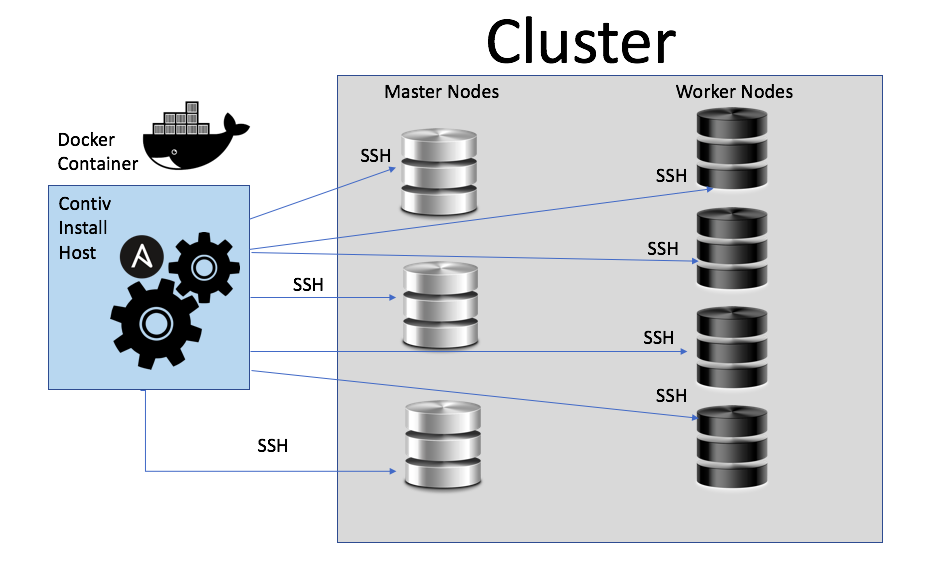

# Contiv Installation for Docker Swarm & Kubernetes 1.4+
Install Contiv on your Docker Swarm or Kubernetes cluster.

## Docker Swarm Installation
### Prerequisites
* CentOS 7.x operating system.
* Python installed on the master and worker nodes.
* Docker installed on the host where you are running the installer.
* Install a Docker Swarm cluster in either legacy swarm mode or native swarm mode (requires 17.03+ version of Docker engine where swarm functionality is inbuilt). Alternatively, use the Contiv installer to setup docker and legacy swarm stack on cluster nodes.

### Contiv Installation with Legacy Swarm Mode

The Contiv Docker Swarm installer is launched from a host external to the cluster.  All the nodes must be accessible to the Contiv Ansible-based installer host through SSH.

* Download the installer bundle:  `curl -L -O https://github.com/contiv/install/releases/download/$VERSION/contiv-$VERSION.tgz` 
If your access to the Internet is limited or slow and you want to download the full Contiv install, choose  
`contiv-full-$VERSION.tgz` 
Note: The full image contains only Contiv components. Installing Docker Swarm will need Internet connectivity.
* Extract the install bundle  `tar oxf contiv-$VERSION.tgz`.
* Change directories to the extracted folder  `cd contiv-$VERSION`

* To install Contiv with Docker Legacy Swarm:  `./install/ansible/install_swarm.sh -f cfg.yml -e <ssh key> -u <username> -i`
* To install Contiv with Docker Legacy Swarm and ACI:  `./install/ansible/install_swarm.sh -f aci_cfg.yml -e <ssh key> -u <username> -i -m aci`

* Example host config files are available at install/ansible/cfg.yml and install/ansible/aci_cfg.yml
* To see additional install options and examples, run  `./install/ansible/install_swarm.sh -h`.

### Contiv Installation with Native Swarm Mode

Docker swarm cluster must be already setup (see [details](https://docs.docker.com/engine/swarm/)). Installer only sets up Contiv v2plugin and dependencies. The Contiv installer can be run from a host in cluster itself.

* Download the installer bundle:  `curl -L -O https://github.com/contiv/install/releases/download/$VERSION/contiv-$VERSION.tgz` 
If your access to the Internet is limited or slow and you want to download the full Contiv install, choose  
`contiv-full-$VERSION.tgz` 
Note: The full image contains only Contiv components.
* Extract the install bundle  `tar oxf contiv-$VERSION.tgz`.
* Change directories to the extracted folder  `cd contiv-$VERSION`

* To install Contiv v2plugin:  `./install/ansible/install_swarm.sh -f cfg.yml -e <ssh key> -u <username> -p`

* Example host config files are available at install/ansible/cfg.yml and install/ansible/aci_cfg.yml
* To see additional install options and examples, run  `./install/ansible/install_swarm.sh -h`.

### Removing Contiv

If you need to remove Contiv from Docker Swarm and return to your original state, you can uninstall Contiv with the following commands:
* To uninstall Contiv and Docker Legacy Swarm: 
`./install/ansible/uninstall_swarm.sh -f cfg.yml -e <ssh key> -u <username> -i`
* To uninstall Contiv and Docker Legacy Swarm with ACI support: 
`./install/ansible/uninstall_swarm.sh -f aci_cfg.yml -e <ssh key> -u <username> -i -m aci`
* To uninstall Contiv and not Docker Legacy Swarm: 
`./install/ansible/uninstall_swarm.sh -f cfg.yml -e <ssh key> -u <username>`
* To uninstall Contiv v2plugin: 
`./install/ansible/uninstall_swarm.sh -f cfg.yml -e <ssh key> -u <username> -p`
* Note: Adding the `-r` flag, will cleanup any Contiv state.

## Kubernetes Installation

### Prerequisites

* Kubernetes 1.4.x, 1.5.x and 1.6.2+ are supported with the following instructions.
* CentOS 7.x operating system
* Install Kubernetes:
  1. kubeadm installs the latest Kubernetes version.  
     For Kubernetes 1.4, see an example script [here.](https://github.com/contiv/install/blob/master/cluster/k8s1.4/k8smaster.sh)
     For Kubernetes 1.6, see an example script [here.](https://github.com/contiv/install/blob/master/cluster/k8s1.6/k8smaster.sh)
  1. Replace step (3/4) in the kubeadm install guide with the following Contiv Installation Instructions. Contiv installation can be done after completing step (4/4).
  1. Instructions to install Kubernetes are available [here.](http://kubernetes.io/docs/getting-started-guides/kubeadm/)
  1. **Kubernetes 1.4 NOTE:** A recent kubeadm update has rendered the latest kubeadm unable to install Kubernetes 1.4. To workaround this issue, please use kubeadm version 1.6.0-0.alpha or earlier.
     Example pre-built RPMs are available as shown [here.](https://github.com/contiv/install/blob/master/cluster/k8s1.4/bootstrap_centos.sh#L22-L26)

### Contiv Installation
* Run the following commands on the kubernetes master host.
* Use curl to get the installer bundle:  `curl -L -O https://github.com/contiv/install/releases/download/$VERSION/contiv-$VERSION.tgz`
* Extract the install bundle  `tar oxf contiv-$VERSION.tgz`.
* Change directories to the extracted folder  `cd contiv-$VERSION`
* To install Contiv with VXLAN:  `sudo ./install/k8s/install.sh -n $CONTIV_MASTER`
* **NOTE:** Use the same IP for CONTIV_MASTER as you use for --api-advertise-addresses in kubeadm init.
* To install Contiv specifying a data plane interface for VLAN:  `sudo ./install/k8s/install.sh -n $CONTIV_MASTER -v <data plane interface like eth1>`
* **NOTE:** Ensure that the data plane interface is the same on all the worker nodes.
* To install Contiv with ACI:  `./install/k8s/install.sh -n $CONTIV_MASTER -a <APIC URL> -u <APIC User> -p <APIC Password> -l <Leaf Nodes> -d <Physical Domain> -e <EPG Bridge domain> -m <APIC contracts unrestricted mode>
  `   For example:   `./install/k8s/install.sh -n <netmaster DNS/IP> -a https://apic_host:443 -u apic_user -p apic_password -l topology/pod-xxx/node-xxx -d phys_domain -e not_specified -m no
  `
   where `$CONTIV_MASTER` is the Contiv proxy or Net Master IP.
* To install Contiv with a custom infra network and gateway:  `./install/k8s/install.sh -n <netmaster DNS/IP> -g <GATEWAY IP> -i <SUBNET>`
* To see additional install options, run   `./install/ansible/install.sh`.

### Removing Contiv
* To uninstall Contiv, retaining the etcd state, run: 
`sudo ./install/k8s/uninstall.sh`
* To uninstall Contiv, cleaning up the etcd state, run: 
`sudo ./install/k8s/uninstall.sh etcd-cleanup`.  Use this option to cleanup all the Contiv network state. 
* To stop Contiv, go to the install folder contiv-$VERSION and run:  `kubectl delete -f .contiv.yaml`
* To start Contiv, go to the install folder contiv-$VERSION and run:  `kubectl apply -f .contiv.yaml`
* To remove etcd state when Contiv is stopped, run:   `rm -rf /var/etcd/contiv-data`
